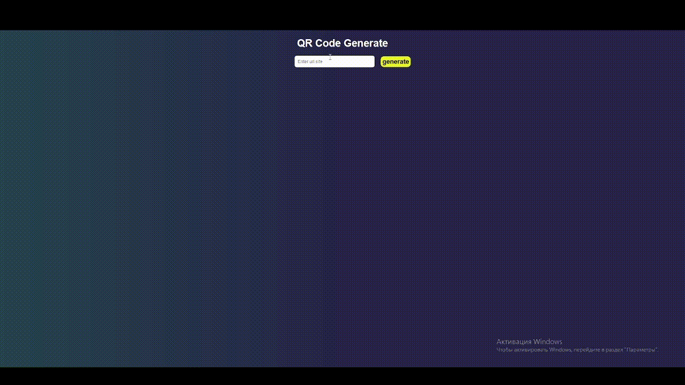

# QR Code Generator & Downloader

**Простое React-приложение для генерации и скачивания QR-кодов**

##  Возможности

- Генерация QR-кода из любой текстовой строки или URL
    
- Скачивание QR-кода в формате PNG
    
- Адаптивный интерфейс
    

## Технологии

- React + TypeScript
    
- Библиотека `react-qr-code` для генерации QR-кодов
    
- `html-to-image` для конвертации в PNG
    
- SCSS для стилей
Как выглядит

## Как использовать

1. Введите текст или URL в поле ввода
    
2. Нажмите кнопку **Generate**
    
3. Нажмите **Download**, чтобы сохранить 
## Установка и запуск
Клонируйте репозиторий:
```bash
git clone https://github.com/TahmazovAziz/QR-Code-generator.git
cd generateQR
```

Установите зависимости:
```bash
npm install
```

Запустите dev-сервер:
```bash
npm run dev
```

